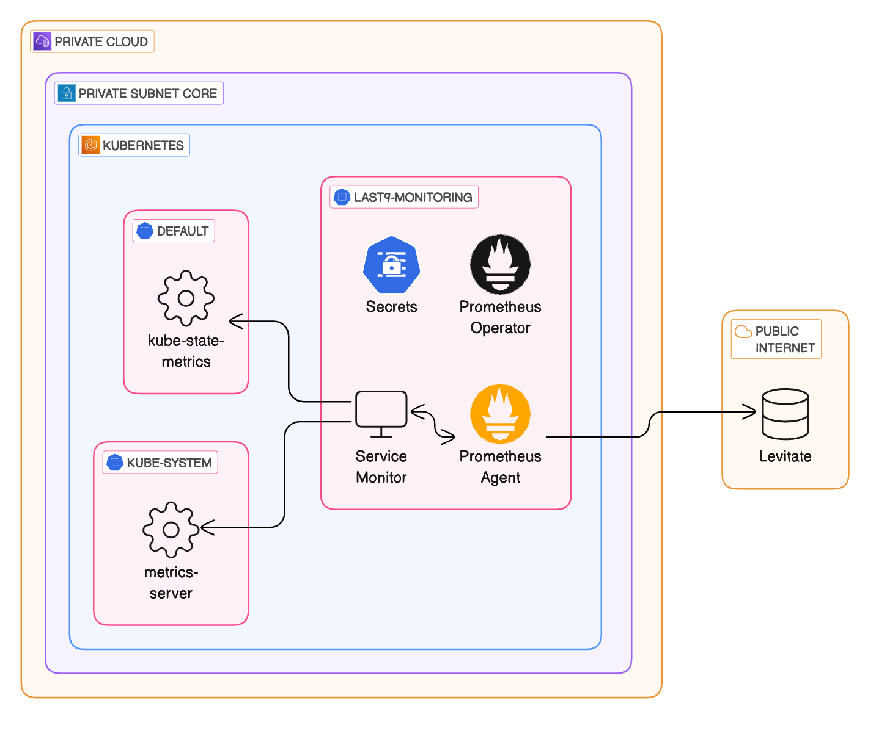

# Prometheus Agent Operator 



## Requirements


Before starting, ensure you have a Kubernetes cluster with administrative privileges.

## Operator Installation

Begin by installing the Custom Resource Definitions (CRDs) and the operator itself, along with the necessary RBAC resources.

Execute the following commands to download the CRDs and set up the operator in the `last9-monitoring` namespace:

```bash
LATEST=$(curl -s "https://api.github.com/repos/prometheus-operator/prometheus-operator/releases/latest" | jq -cr .tag_name)
curl -sL "https://github.com/prometheus-operator/prometheus-operator/releases/download/${LATEST}/bundle.yaml" > ./bundle.yaml

sed -i 's/namespace: default/namespace: last9-monitoring/g' bundle.yaml

kubectl create -f ./namespace.yaml -f ./bundle.yaml
```

The operator might take a few minutes to become fully operational. Monitor its status using this command:

```bash
kubectl wait --for=condition=Ready pods -l  app.kubernetes.io/name=prometheus-operator -n last9-monitoring
```

The Prometheus Operator enables the declaration of desired states for Prometheus and Alertmanager clusters, as well as the Prometheus configuration through custom resources. In this guide, we focus on the following resources:

* `Prometheus`
* `ServiceMonitor`
* `PodMonitor`

Here, the `Prometheus` resource specifies the desired setup for a Prometheus instance, while the `ServiceMonitor` and `PodMonitor` resources identify the monitoring targets for Prometheus.

## Secrets

Generate your secrets in the [secret.yaml](secret.yaml) file by converting them into base64 encoded strings


## Prometheus Agent Installation

### Commands
Check [prometheus-agent.yaml](prometheus-agent.yaml) for any placeholder values and replace them with correct values.

```shell
kubectl apply -f ./prometheus-agent.yaml -f ./secret.yaml --kubeconfig=$KUBECONFIG -n last9-monitoring
```

### Verification
To verify that the instance is up and running, run:

```shell
kubectl get -n last9-monitoring prometheus-agent prometheus-agent -w
```

## Service Monitor Installation

### Commands

```shell
kubectl apply -f ./service-monitor.yaml --kubeconfig=$KUBECONFIG -n last9-monitoring
```

### Verification
To verify that the service monitors are up and running, run:

```shell
kubectl get servicemonitor --kubeconfig=$KUBECONFIG -n last9-monitoring
```

## [Quick Installation Tutorial](https://www.loom.com/share/b30484323edd499e843ecb5df5e9eb06)

<div>
    <a href="https://www.loom.com/share/b30484323edd499e843ecb5df5e9eb06">
      
    </a>
</div>
